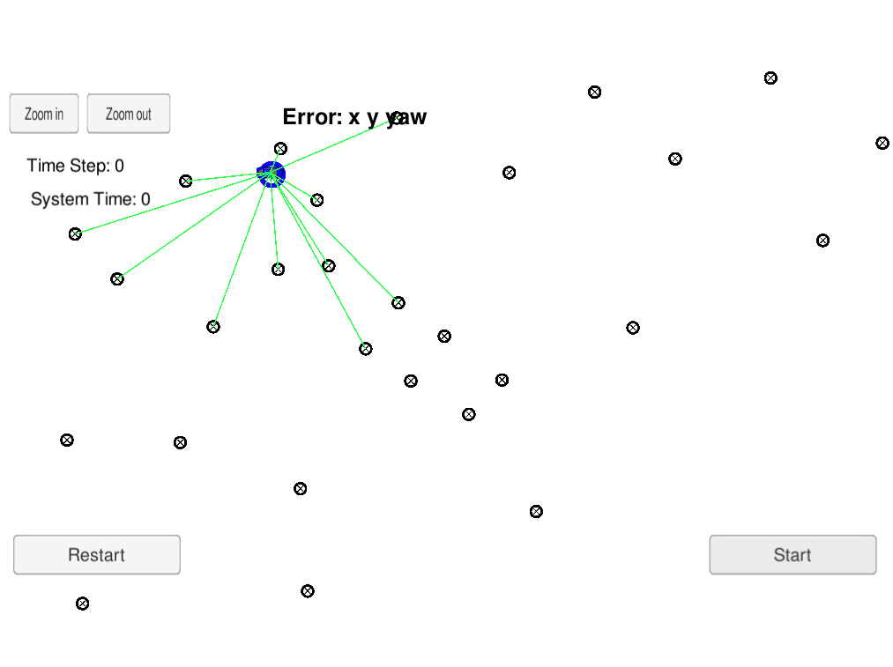
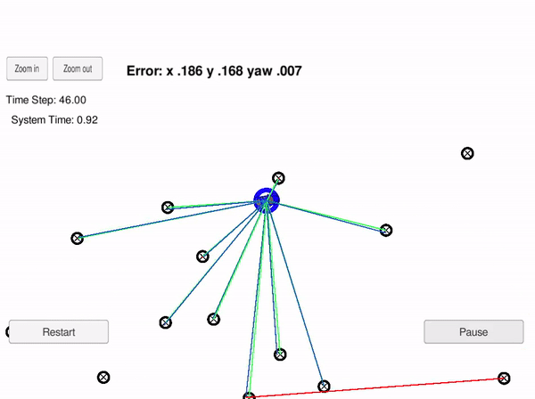
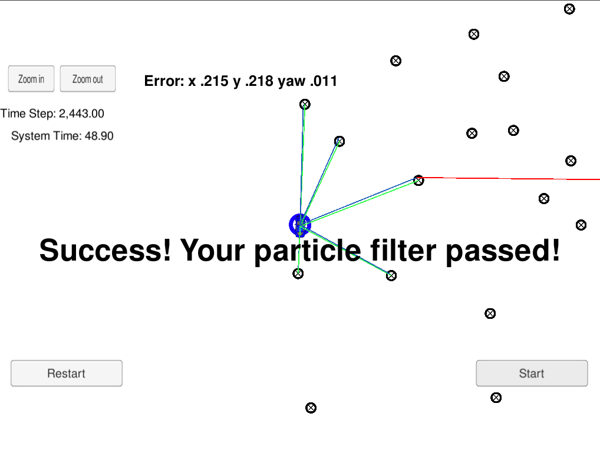
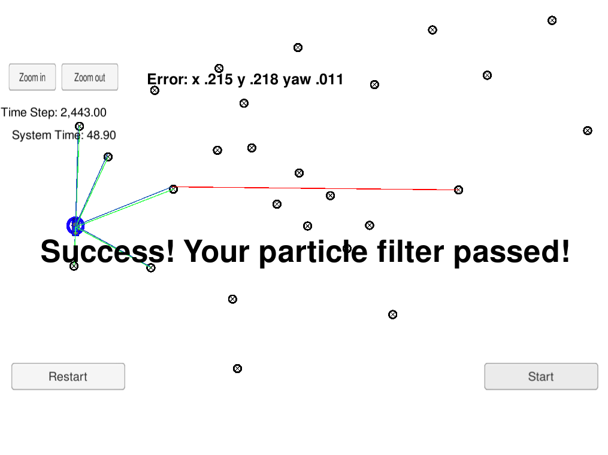

# CarND-Kidnapped-Vehicle-Project
[](http://www.udacity.com/drive)

 

# Overview
This repository contains all the code needed to complete the final project for the Localization course in Udacity's Self-Driving Car Nanodegree.
The robot has been kidnapped and transported to a new location! Luckily it has a map of this location, a (noisy) GPS estimate of its initial location, and lots of (noisy) sensor and control data.

In this project you I implemented a 2 dimensional particle filter in C++. The particle filter will be given a map and some initial localization information (analogous to what a GPS would provide). At each time step your filter will also get observation and control data.

Markov localization addresses the problem of state estimation from sensor data. Markov localization is a probabilistic algorithm: Instead of maintaining a single hypothesis as to where in the world a robot might be, Markov localization maintains a probability distribution over the space of all such hypotheses. The probabilistic representation allows it to weigh these different hypotheses in a mathematically sound way. 

# Results

*1 - Accuracy: Does the particle filter localize the vehicle to within the desired accuracy?*  
*2 - Performance: Does the particle run within the specified time of 100 seconds?*  
*3 - General: Does the code use a particle filter to localize the robot?*

These criteria are checked automatically when ./run.sh is typed in the terminal. If the output says "Success! the particle filter passed!" then it means the project mets all criteria.

 
 
 

## Running the Code

This project involves the Term 2 Simulator which can be downloaded [here](https://github.com/udacity/self-driving-car-sim/releases). The Term 2 Simulator includes a graphical version of the Kidnapped Vehicle Project. Running the simulator you can see the path that the car drives along with all of its landmark measurements. The simulator can also display the best particle's sensed positions, along with the corresponding map ID associations. This can be extremely helpful to make sure transition and association calculations were done correctly. Notice that the green laser sensors from the car nearly overlap the blue laser sensors from the particle, this means that the particle transition calculations were done correctly. 

Once the scene is loaded you can hit the START button to observe how the car drives and observes landmarks. At any time you can press the PAUSE button, to pause the scene or hit the RESTART button to reset the scene. Also the ARROW KEYS can be used to move the camera around, and the top left ZOOM IN/OUT buttons can be used to focus the camera. Pressing the ESCAPE KEY returns to the simulator main menu

This repository includes two files that can be used to set up and install uWebSocketIO for either Linux or Mac systems. For windows you can use either Docker, VMware, or even Windows 10 Bash on Ubuntu to install uWebSocketIO. The simulator provides the script for the noisy position data, vehicle controls, and noisy observations. The script feeds back the best particle state.

Once the install for uWebSocketIO is complete, the main program can be built and ran by doing the following from the project top directory.

1. mkdir build
2. cd build
3. cmake ..
4. make
5. ./particle_filter

Alternatively some scripts have been included to streamline this process, these can be leveraged by executing the following in the top directory of the project:

1. ./clean.sh
2. ./build.sh
3. ./run.sh

Tips for setting up the environment can be found [here](https://classroom.udacity.com/nanodegrees/nd013/parts/40f38239-66b6-46ec-ae68-03afd8a601c8/modules/0949fca6-b379-42af-a919-ee50aa304e6a/lessons/f758c44c-5e40-4e01-93b5-1a82aa4e044f/concepts/23d376c7-0195-4276-bdf0-e02f1f3c665d)

The program main.cpp has already been filled out, but feel free to modify it.

Here is the main protocol that main.cpp uses for uWebSocketIO in communicating with the simulator.

**INPUT**: values provided by the simulator to the c++ program

// sense noisy position data from the simulator

    ["sense_x"]
    ["sense_y"]
    ["sense_theta"]

// get the previous velocity and yaw rate to predict the particle's transitioned state

    ["previous_velocity"]
    ["previous_yawrate"]

// receive noisy observation data from the simulator, in a respective list of x/y values

    ["sense_observations_x"]
    ["sense_observations_y"]

**OUTPUT**: values provided by the c++ program to the simulator

// best particle values used for calculating the error evaluation

    ["best_particle_x"]
    ["best_particle_y"]
    ["best_particle_theta"]

//Optional message data used for debugging particle's sensing and associations

// for respective (x,y) sensed positions ID label

    ["best_particle_associations"]

// for respective (x,y) sensed positions

    ["best_particle_sense_x"] <= list of sensed x positions
    ["best_particle_sense_y"] <= list of sensed y positions

---
## Implementing the Particle Filter
The directory structure of this repository is as follows:

```
root
|   build.sh
|   clean.sh
|   CMakeLists.txt
|   README.md
|   run.sh
|
|___data
|   |   
|   |   map_data.txt
|   
|___src
    |   helper_functions.h
    |   main.cpp
    |   map.h
    |   particle_filter.cpp
    |   particle_filter.h
```

The only file that I modified was `particle_filter.cpp` in the `src` directory. The file contains the scaffolding of a `ParticleFilter` class and some associated methods. Read through the code, the comments, and the header file `particle_filter.h` to get a sense for what this code is expected to do.

## Inputs to the Particle Filter
You can find the inputs to the particle filter in the `data` directory.

#### The Map*
`map_data.txt` includes the position of landmarks (in meters) on an arbitrary Cartesian coordinate system. Each row has three columns
1. x position
2. y position
3. landmark id

### All other data the simulator provides, such as observations and controls.

> * Map data provided by 3D Mapping Solutions GmbH.

Thanks :)